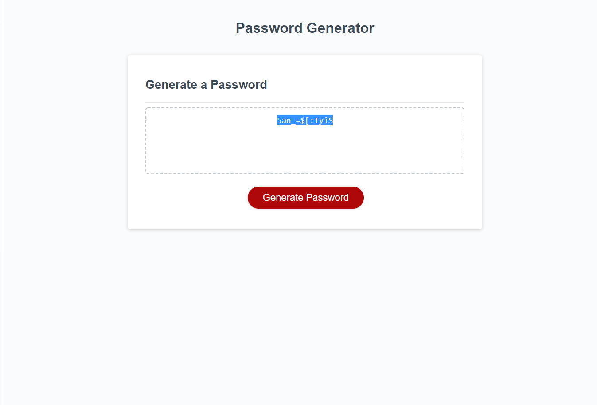

# Description
The password generator uses JavaScript to prompt the user for inputs on password length and what types of characters should be included in the generated password (lower case, upper case, numbers, special characters). Once valid inputs have been entered the password generator will generate a password which contains the requested characters and is of the correct length.

## Screenshot

## Live App Link
[Password Generator](https://tbellenger.github.io/password-gen/)

